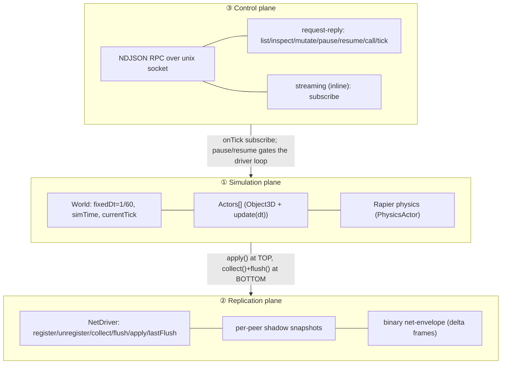

# Engine Overview & Implementation Guide

> Reference for porting the **mars** real-time sim core into **haystack**.
> mars is Bun + vanilla three.js + Rapier + a unix-socket RPC. haystack is
> Bun + Hono + React/react-three-fiber + three.js. Every non-obvious claim
> below cites `src/<path>:<line>` against the **mars** repo
> (`/Users/hv/repos/mars`). Where haystack must diverge, it says so.

---

## Purpose

This is the index and the big picture. The mars engine is a small, runtime-agnostic
authoritative simulation core that the same code runs three ways: a single-process
browser **listen-server**, a headless **dedicated-server**, and a thin **multiplayer-client**.
Everything hangs off one object — `World` (`src/core/world.ts:22`) — which owns a
fixed-step tick loop, a flat actor list, and a three.js scene-graph root, and which
deliberately knows nothing about rendering, the DOM, or sockets. Read this doc first;
then follow the reading order into the sibling docs for each plane.

---

## Mental model: three planes meeting at `World.tick()`

mars separates concerns into **three planes**. They are largely independent and meet
at exactly one place — the body of `World.tick()` (`src/core/world.ts:195`).



**① Simulation plane.** `World` advances `simTime` by `fixedDt * timeScale` exactly once
per `tick()`, then walks `actors[]` group-by-group in `TICK_GROUP_ORDER`
(`src/core/tick-group.ts:40`) calling `actor.update(dt)` in registration order. One actor
(`PhysicsActor`, `tickGroup = Physics`) steps Rapier; the rest read back poses, run
gameplay, or present. `step(wallDt)` (`src/core/world.ts:234`) is the real-time front-end:
a capped fixed-step accumulator. Node drives `tick()` directly for determinism. See
[./world-and-actors.md](./world-and-actors.md).

**② Replication plane.** Each authoritative actor declares a static `replicatedProperties`
manifest (`src/core/actor.ts:43`). At the **bottom** of every tick the `NetDriver` captures
those fields into POJO snapshots, shadow-diffs against what each peer last saw, and emits
only the changed fields — as an in-process hand-off (listen-server) or a float64 binary
envelope (dedicated-server). At the **top** of the next tick `apply()` writes received
deltas onto proxy actors. Optional client-side prediction lets the owning peer integrate
its own input locally and reconcile against server acks. See
[./replication.md](./replication.md) and [./client-side-prediction.md](./client-side-prediction.md).

**③ Control plane.** A separate NDJSON-over-unix-socket RPC drives a headless server: a
pure dispatcher routes seven request-reply verbs over `VerbContext { world, mode }`
(`src/core/rpc-verbs.ts:12`), plus a streaming `subscribe` verb carved out inline. Tick mode
(free-running vs paused) lives **outside** `World`, in a shared `TickModeRef`
(`src/core/rpc-verbs.ts:10`). See [./command-rpc.md](./command-rpc.md).

### Where the planes meet — exact `tick()` order

The ordering is load-bearing and identical for every driver
(`src/core/world.ts:195-226`):

```ts
tick(): void {
  const dt = this.fixedDt * this.timeScale          // 1. advance time
  this.simTime += dt
  if (this.netDriver) this.netDriver.apply()         // 2. inbound at TOP
  for (const group of TICK_GROUP_ORDER)              // 3. update(dt) per group,
    for (const actor of this.actors)                 //    registration order
      if (actor.tickGroup === group) actor.update(dt)
  if (this.netDriver) {                              // 4. outbound at BOTTOM
    const auth = this.actors.filter(a => a.role === Role.Authoritative)
    this.netDriver.collect(auth)
    this.netDriver.flush()
  }
  this.frame++; this.currentTick++                   // 5. counters BEFORE listeners
  for (const cb of this._tickListeners) cb()         // 6. onTick (post-increment)
}
```

Two facts to internalize:

- **`apply()` is at the top, `collect()`+`flush()` at the bottom.** Proxies reconcile
  against fresh server state before their own `update()`; outgoing deltas reflect the
  tick's final post-everything pose.
- **Counters increment before listeners fire.** `onTick` callbacks observe the
  post-increment value — `world.test.ts` asserts the sequence is `[1, 2]`, not `[0, 1]`
  (`src/core/world.ts:223-225`).

---

## File map (core + transport)

| Path (mars)                              | Responsibility                                                                                                                                                                                                                           |
| ---------------------------------------- | ---------------------------------------------------------------------------------------------------------------------------------------------------------------------------------------------------------------------------------------- |
| `src/core/world.ts`                      | `World`: counters, `sceneRoot`, `localFrameOrigin`, `mainCamera`, `netDriver`; actor lifecycle (`addActor`/`attachActor`/`activateActor`/`removeActor`/`setupActors`/`dispose`); `tick()`/`step()`. Exports `LAYER_NEAR`/`LAYER_FAR`.    |
| `src/core/tick-group.ts`                 | `TickGroup` enum (`PrePhysics=0, Physics=1, PostPhysics=2, PostUpdateWork=3`) and `TICK_GROUP_ORDER`.                                                                                                                                    |
| `src/core/role.ts`                       | `Role` enum: `Authoritative \| SimulatedProxy \| AutonomousProxy`.                                                                                                                                                                       |
| `src/core/actor.ts`                      | Abstract `Actor<TState>`: `object3D`, `world`, abstract `id`, `role` (default Authoritative), `tickGroup` (default PrePhysics), static `replicatedProperties`/`callable`, `setup()`/`update()`/`state()`/`getTargetEntry()`/`dispose()`. |
| `src/core/actor-registry.ts`             | Module-global `className → factory` map: `registerActorClass`/`createActor`/`knownClasses`/`resetActorRegistry`.                                                                                                                         |
| `src/core/replication.ts`                | Shadow-diff primitives: `ReplicatedField`/`ReplicatedType`/`ReplicatedSnapshot`, `captureSnapshot`, `diffSnapshots`.                                                                                                                     |
| `src/core/net-driver.ts`                 | `NetDriver` interface: `register`/`unregister`/`collect`/`flush`/`apply`/`lastFlush`.                                                                                                                                                    |
| `src/core/in-memory-driver.ts`           | `InMemoryNetDriver`: loopback driver for the listen-server. Adds `registerReceiver`.                                                                                                                                                     |
| `src/core/net-envelope.ts`               | Binary codec: `packEnvelope`/`unpackEnvelope`, `packActorSnapshot`/`unpackActorSnapshot`, `FIELD_BYTES`.                                                                                                                                 |
| `src/core/rpc-protocol.ts`               | NDJSON wire types + codecs (`Request`/`Response`/`ErrorCode`).                                                                                                                                                                           |
| `src/core/rpc-dispatcher.ts`             | `RPCError`, `Handler`, pure `Dispatcher` (verb registry + error policy).                                                                                                                                                                 |
| `src/core/rpc-verbs.ts`                  | `TickModeRef`/`VerbContext` + `registerVerbs()` (the seven request-reply verbs).                                                                                                                                                         |
| `src/core/rpc-server.ts`                 | Bun unix-socket host: line framing, dispatch, the inline `subscribe` carve-out.                                                                                                                                                          |
| `src/core/rpc-client.ts`                 | Spawn-act-exit client (`sendRequest`).                                                                                                                                                                                                   |
| `src/verification/state-snapshot.ts`     | `snapshot(world)` → JSON-safe `StateSnapshot` for headless verification and `subscribe` streaming.                                                                                                                                       |
| `src/render/render-system.ts`            | Browser-only consumer: rAF loop calls `world.step(wallDt)` then renders `world.sceneRoot` via `world.mainCamera`.                                                                                                                        |
| `src/runtime/listen-server.ts`           | Listen-server entry: `InMemoryNetDriver`, build scene, `setupActors`, rAF `step`.                                                                                                                                                        |
| `src/runtime/dedicated-server.ts`        | Headless server: `WebSocketNetDriver`, RPC, per-peer WS join handshake, free-running `setInterval`.                                                                                                                                      |
| `src/runtime/multiplayer-client.ts`      | Thin client (`?mode=client`): `WebSocketClientDriver`, spawn-driven proxies, prediction.                                                                                                                                                 |
| `src/runtime/websocket-net-driver.ts`    | Server driver: per-peer shadow, owner-skip, binary envelope packing + injected `send`.                                                                                                                                                   |
| `src/runtime/websocket-client-driver.ts` | Client driver: `ingest`, `apply`, AutonomousProxy stash (`takeLastServerFrame`).                                                                                                                                                         |
| `src/runtime/wire-protocol.ts`           | JSON control protocol: `WireMessage` union + `encodeMessage`/`decodeMessage`.                                                                                                                                                            |
| `src/runtime/sim-scene.ts`               | Scene composition: `buildStaticScene`, `spawnFreighter`, `buildSimScene`.                                                                                                                                                                |

---

## Reading order

1. **[./README.md](./README.md)** — this doc. The three planes and the porting plan.
2. **[./world-and-actors.md](./world-and-actors.md)** — `World`, the fixed-step loop, tick
   groups, the `Actor` base, the registry, and the attach → setup → activate lifecycle.
3. **[./replication.md](./replication.md)** — shadow-diff `NetDriver`, the binary envelope,
   and the per-peer WebSocket transport + JSON control protocol.
4. **[./client-side-prediction.md](./client-side-prediction.md)** — the AutonomousProxy
   `PredictionWorld`, input buffering, and server reconciliation.
5. **[./command-rpc.md](./command-rpc.md)** — the NDJSON RPC control plane and CLI.
6. **[./runtime-topologies.md](./runtime-topologies.md)** — how the three entry points
   compose one `World` plus a driver, and the per-peer join handshake.

---

## Key types you will meet everywhere

```ts
// src/core/role.ts:8
enum Role {
  Authoritative = "authoritative",
  SimulatedProxy = "simulated-proxy",
  AutonomousProxy = "autonomous-proxy",
}

// src/core/tick-group.ts:15 / :40
enum TickGroup {
  PrePhysics = 0,
  Physics = 1,
  PostPhysics = 2,
  PostUpdateWork = 3,
}
const TICK_GROUP_ORDER: readonly TickGroup[] = [
  TickGroup.PrePhysics,
  TickGroup.Physics,
  TickGroup.PostPhysics,
  TickGroup.PostUpdateWork,
];

// src/core/replication.ts:16
interface ReplicatedField {
  name: string;
  type: "scalar" | "vec3" | "quat";
  get: (actor: unknown) => unknown;
  set?: (actor: unknown, value: ReplicatedValue) => void; // optional; default writer if omitted
}

// src/core/net-driver.ts:16
interface NetDriver {
  register(actor: Actor): void;
  unregister(actor: Actor): void;
  collect(authoritativeActors: readonly Actor[]): void;
  flush(): void;
  apply(): void;
  readonly lastFlush: ReadonlyMap<string, ReplicatedSnapshot>;
}
```

`Role` gates **what** (only `Authoritative` actors register and are collected; only
`AutonomousProxy` actors run prediction). `TickGroup` gates **when**. The two are
independent — `World` no longer branches on role inside the group loop
(`src/core/world.ts:204-213`); it only uses `Role` at the net boundaries
(`src/core/world.ts:149`, `:218`).

---

## Invariants worth pinning to the wall

- **`fixedDt = 1/60`, hardcoded** (`src/core/world.ts:23`). Never feed raw wall time into
  simulation — only `step()` sees wall time, and it drains it in fixed chunks.
- **`step()` caps at 8 ticks/call and zeroes the accumulator on overflow**
  (`src/core/world.ts:241`) — a spiral-of-death guard that silently drops sim time under
  heavy stall. `RenderSystem` additionally clamps `wallDt` to `≤ 0.1s` before calling
  `step` (`src/render/render-system.ts:50`).
- **`timeScale` scales `simTime` per tick, not how many ticks run.** `timeScale = 0`
  pauses simulation advance but `step()` still consumes wall time
  (`src/core/world.ts:196`).
- **attach vs activate is a real split, not sugar.** `attachActor` wires the world ref +
  scene graph + id-uniqueness check **without ticking** (`src/core/world.ts:131`);
  `activateActor` pushes into `actors[]` and registers with the driver
  (`src/core/world.ts:146`). The split exists so async `setup()` (FBX load, `RAPIER.init`)
  can finish before the actor is ticked — ticking a half-built actor crashes. `addActor`
  is the synchronous attach+activate convenience (`src/core/world.ts:119`).
- **Net registration is role-gated.** `activateActor` registers with the driver only when
  `netDriver && role === Role.Authoritative` (`src/core/world.ts:149`). On clients,
  proxies are receivers, registered separately by the spawn handler.
- **`onTick` fires at the bottom, post-increment** (`src/core/world.ts:223-225`).
  Subscribers and snapshot frames observe the already-incremented counter.
- **`World` owns no renderer/DOM.** It owns `sceneRoot` (a `THREE.Group`); the browser
  `RenderSystem` wraps a `THREE.Scene` around it (`src/render/render-system.ts:37-38`); in
  Node nobody draws it.

---

## One concrete path, end to end (replication of a moved freighter)

Following an authoritative pose change from server to a remote `SimulatedProxy` to the
screen (verified against `src/core/world.ts`, `src/runtime/websocket-net-driver.ts`,
`src/core/net-envelope.ts`, `src/render/render-system.ts`):

1. **Server tick top.** `apply()` runs — on the server, `WebSocketNetDriver.apply()` is a
   deliberate no-op (nothing inbound).
2. **Update.** The authoritative `FreighterActor` (tickGroup `PostPhysics`) reads its pose
   back from the Rapier body into `mesh.group` and the `linVel`/`angVel` mirrors. That is
   where the new replicated value lands on the actor.
3. **Tick bottom — send.** `auth = actors.filter(role === Authoritative)`; `collect(auth)`
   captures each actor's `replicatedProperties` into POJO snapshots (deep-cloning vec3/quat
   so the shadow can't be aliased); `flush()` diffs `lastCapture` against **each peer's own
   shadow** and packs only changed fields.
4. **Encode.** `packEnvelope` writes a 10-byte LE header — `tick @0`, `ackClientTick @4`,
   `entryCount @8` — then per actor `[u16 idLen][id][u32 payloadLen][payload]`, where the
   payload is `[u8 fieldCount][⌈N/8⌉ dirty bitmask, LSB-first][f64-LE values in descriptor
order]`. All float64; no magic, no version (`src/core/net-envelope.ts:1-35`).
5. **Client ingest.** A binary WS frame → `driver.ingest(bytes)` → `unpackEnvelope` (skips
   actors with no registered receiver via the `payloadLen` prefix) → field-level merge into
   `pending`.
6. **Client tick top — apply.** `apply()` drains `pending`. For a `SimulatedProxy` it writes
   each present field via the default writer — `desc.get(target).set(x,y,z[,w])` on the live
   `Vector3`/`Quaternion`. (The owning peer's `AutonomousProxy` is stashed, not written.)
7. **Render.** Back in the rAF loop, after `world.step(wallDt)` returns, the renderer draws
   `sceneRoot` via `mainCamera` **in the same animation frame**
   (`src/render/render-system.ts:52-60`). Net: state lands on the proxy one server-tick later
   in wall time; apply (tick top) and render (after step) are the same rAF.

The header `tick` lags the carried state by one tick: `driver.setTick(world.currentTick)`
is wired via `world.onTick`, which fires at the **bottom** of the tick, so the value packed
during the next tick's flush is the previous tick's count. Harmless, but know it when
debugging tick numbers.

---

# Implementation guide for haystack

This section is the gap analysis turned into a plan. It assumes haystack's current shape:
a stateless REST space-mining game — `Bun.serve` (`src/server/main.ts`) hosting a Hono app
(`src/server/app.ts`) with JSON endpoints, all state in SQLite (`src/server/db.ts`), a
request-triggered lazy Euler step (`advanceWorld` in `src/server/sim.ts`), and a
React/r3f client that polls `GET /api/world` every 1200ms and replaces a full
`WorldSnapshot` in React state (`src/client/App.tsx`, `src/client/api.ts`).

## What haystack already has vs. what is missing

| mars subsystem                                          | haystack today                                                                                                                                                               | status      |
| ------------------------------------------------------- | ---------------------------------------------------------------------------------------------------------------------------------------------------------------------------- | ----------- |
| ① World + fixed-step loop + tick groups                 | `advanceWorld`: lazy, request-triggered, variable-dt single Euler step keyed off `meta.last_tick_ms`. No loop, no tick counter, no groups. Math reusable; scheduling absent. | **partial** |
| ② Actor base + registry + lifecycle                     | Entities are SQLite rows + mapper functions. No live objects, no per-actor tick, no registry, no spawn/destroy.                                                              | **missing** |
| ③ Replication core (shadow-diff + envelope)             | `getSnapshot` serializes the full world to JSON per poll. No shadow, no baseline, no deltas, no binary frame. `WorldSnapshot` is the right shape but unversioned.            | **missing** |
| ④ Replication transport (WS drivers + control protocol) | All HTTP request-response. No WebSocket, no persistent connection, no server push.                                                                                           | **missing** |
| ⑤ Client-side prediction + reconciliation               | POST then refetch whole world (~1.2s latency). No input sequence, no local sim, no reconcile.                                                                                | **missing** |
| ⑥ Command-RPC control plane                             | CLI (`src/cli/main.ts`) with a clean verb/flag parser + persisted session — but it drives the **public** REST API. No privileged control channel, no admin verbs.            | **partial** |
| ⑦ Runtime topologies                                    | One shape: stateless REST server + polling clients. No headless authoritative loop, no thin remote-authority client.                                                         | **missing** |

The honest summary: haystack has a **domain model, persistence, an HTTP transport, and a
thin sim**, but essentially none of mars's real-time machinery. The largest missing piece
is the replication core (③) — the heart of mars.

## Recommended porting order

Each step unblocks the next. Do not skip ahead to prediction or topologies before the loop
and the actor model exist.

### Step 1 — In-memory World + fixed-step tick loop (subsystem ①)

Build a `World` holding live state, seeded from `db.ts` on boot, plus a fixed-timestep
accumulator driver. Port `World.tick()`/`World.step()` near-verbatim from
`src/core/world.ts:195-244`, keeping `fixedDt = 1/60` (or pick a server rate, e.g. 20–30 Hz,
but keep it **fixed**) and the 8-tick cap. Drive it from a Bun timer (`setInterval(1000/hz)`)
in haystack's server process, not from request handlers.

- **Refactor `advanceWorld` into a per-actor fixed-dt step.** Reuse its arithmetic
  (`pos += vel·dt`, heat decay) but run it for **every** actor **every** tick with a
  **constant** `dt` from the accumulator — never variable, never request-triggered. The
  variable-dt model is incompatible with a fixed timestep and must be replaced, not
  scheduled.
- **Invert the source of truth.** mars expects an authoritative in-memory `World`; SQLite
  must be demoted to **seed + periodic persistence**. Per-tick SQL writes would bottleneck
  the loop. Flush to SQLite on an interval or on shutdown, not every tick.
- Iterate `TICK_GROUP_ORDER` even if you start with one group; the ordering hook is cheap
  to add now and expensive to retrofit.

### Step 2 — Actor base + registry + lifecycle (subsystem ②)

Wrap `Ship`/`Asteroid`/`Deposit`/`Structure` as actors with a stable `id`, a `tick`/`update`
hook, and spawn/destroy through a registry the `World` iterates. Port the attach → setup →
activate split (`src/core/world.ts:131-154`) and the module-global registry
(`src/core/actor-registry.ts`). Port `createPilot`/`ensureShip` to **spawn live actors**
and add flush-to-SQLite. This gives the loop something to iterate and the replicator
something to diff.

- haystack has no async asset load on the server, so `addActor` (synchronous attach+activate)
  covers most cases — but keep the split available for the client (r3f mesh/material setup
  is effectively async).
- Default `role = Authoritative`, `tickGroup = PrePhysics`, and look up the replication
  manifest as a **static** on the class via `actor.constructor` (`src/core/actor.ts:43`,
  `:51`).

### Step 3 — Replication core (subsystem ③)

Per-client shadow/baseline of replicated actor state. Each tick, diff live actors against
the shadow into a delta and advance the shadow. Port `captureSnapshot`/`diffSnapshots`
(`src/core/replication.ts`) and the per-peer shadow loop from
`WebSocketNetDriver.flush()` (`src/runtime/websocket-net-driver.ts`).

- **De-risk first with a JSON delta envelope** off `WorldSnapshot`, then swap to the mars
  binary envelope (`src/core/net-envelope.ts`) once the diff loop is correct. The binary
  format is `tick`/`ack`/`entryCount` header + length-prefixed per-actor deltas; the
  `payloadLen` prefix is what lets a client skip actors it hasn't spawned yet — keep it.
- **Add per-actor identity + version metadata to `src/shared/types.ts`.** `WorldSnapshot` is
  the right shape but unversioned. Add `id` and a monotonic version/tick field without
  breaking the three consumers (server, client, CLI).
- Keep replication **observation-driven**: no `markDirty`; diff at the tick boundary. A
  field changed and reverted within one tick produces no delta.
- One map **per client**, not a single global last-flush. The full-baseline-on-join behavior
  emerges purely from a new peer starting with an **empty** shadow + treating
  `shadow[key] === undefined` as a difference. Do not pre-seed.

### Step 4 — Replication transport: WebSocket over Hono (subsystem ④)

This is haystack's biggest divergence from mars. mars uses a raw Bun unix socket for control
and a Bun WebSocket for gameplay; haystack should use **WebSocket over Hono**, served by
`Bun.serve`.

- Add a WS upgrade route on the Hono app (`src/server/app.ts`) via the Bun WebSocket handler
  or Hono's ws helper, instead of mars's raw socket. Wrap the mars socket abstraction so the
  diff envelope stays **transport-agnostic** — the driver should not know whether bytes go
  over a unix socket or a Hono-upgraded WS.
- The server WS driver does the JSON control handshake (connect/auth/subscribe), sends a
  baseline, then streams per-tick diffs. Mirror mars's two-channel design: **text frames =
  JSON control** (`hello`/`spawn`/`despawn`/`input`/`peer-*`), **binary frames =
  replication**, distinguished only by WS frame type (`typeof data === 'string'`). Port the
  client driver's `ingest`/`apply` from `src/runtime/websocket-client-driver.ts`.
- **Keep REST endpoints during migration.** They remain a fallback and keep the CLI working
  while the WS path is built.

### Step 5 — Client-side prediction + reconciliation (subsystem ⑤)

Run a predicted copy of the same fixed-step sim on the owning client. Port the
AutonomousProxy loop conceptually from
[./client-side-prediction.md](./client-side-prediction.md): buffer inputs with sequence
numbers, apply locally, send over WS, and on each server diff reconcile by snapping
authoritative state and replaying un-acked inputs.

- **Stamp input with a client prediction tick, not the world tick**, and have the server
  echo it back as `ackClientTick` so the client can find the matching buffer entry.
- **Feed predicted/interpolated state into r3f via refs and `useFrame`, not `setState` per
  tick.** This is the key React adaptation: React state holds only coarse HUD data;
  positions and interpolation live in refs updated inside the `useFrame` loop (the same hook
  that currently only spins the ship). Per-tick `setState` would thrash React.
- The owning peer's actor must be **excluded from direct replication apply** — route its
  inbound frames into a single-shot stash that the prediction tick consumes
  (mars: `takeLastServerFrame`). Pair this with locally applying input commands, because the
  replication path deliberately skips the predicted actor.
- **Inputs become sequenced WS commands**, not fire-and-forget REST POSTs — reconciliation
  needs sequence numbers to ack and replay. Replace the 1200ms poll with the WS diff stream.

### Step 6 — Command-RPC control plane (subsystem ⑥)

Add a dedicated control listener with verbs distinct from gameplay (`spawn`, `kick`,
`set-tickrate`, `inspect`, `snapshot`). Reuse the existing CLI verb-dispatch and session-file
patterns (`src/cli/main.ts`); they are sound. Port the pure dispatcher + verb registry from
`src/core/rpc-dispatcher.ts` and `src/core/rpc-verbs.ts`, and the shared mutable `TickModeRef`
so `pause`/`resume` flip a flag the tick loop reads.

- **The control transport must not assume a unix socket in all topologies.** Hosted Bun may
  not allow one. Use a **localhost-bound privileged WS or HTTP channel over Hono** as the
  portable equivalent, reserving an actual unix socket for the headless dedicated-server case.
- Keep the layering mars uses: a pure codec (no I/O), a pure dispatcher (never throws out of
  `dispatch`), and a thin transport that does framing + the `subscribe` carve-out. That
  separation is what makes verbs unit-testable without a socket.

### Step 7 — Compose runtime topologies (subsystem ⑦)

Parameterize `src/server/main.ts` into the three shapes, selected by flag/env:

- **dedicated-server** — headless loop + WS net + the control plane.
- **listen-server** — the same loop hosting an in-process client (browser).
- **multiplayer-client** — a thin client to a remote authority via the WS driver, with **no**
  local authoritative loop.

Make `Role` the single composition axis (mars does): the server stamps `Authoritative`; the
client computes `AutonomousProxy` vs `SimulatedProxy` from whether the spawned actor is its
own. Keep all WebGPU/three-heavy presentation out of the server path.

## Adaptation cheat-sheet (mars → haystack)

| Concern                   | mars                                              | haystack adaptation                                                                                                                      |
| ------------------------- | ------------------------------------------------- | ---------------------------------------------------------------------------------------------------------------------------------------- |
| Gameplay transport        | Bun WebSocket                                     | WebSocket upgrade route on Hono, served by `Bun.serve`. Wrap the socket so the envelope stays transport-agnostic.                        |
| Control transport         | raw Bun unix socket                               | localhost-bound privileged WS/HTTP over Hono; real unix socket only for headless dedicated-server.                                       |
| Source of truth           | in-memory `World`                                 | invert from SQLite: in-memory `World` is truth; SQLite = seed + periodic persistence.                                                    |
| Client render integration | vanilla three rAF loop                            | r3f `useFrame` + refs for per-tick state; React `setState` only for coarse HUD.                                                          |
| Input                     | (mars) JSON `InputMessage` outside the net driver | sequenced WS commands (not fire-and-forget REST POSTs); REST may stay as fallback.                                                       |
| Sim step                  | per-actor fixed-dt `update(dt)`                   | replace `advanceWorld`'s variable-dt single step; reuse its arithmetic with a constant `dt`, run every actor every tick.                 |
| Shared DTOs               | per-actor manifests                               | reuse `src/shared/types.ts` across server/client/CLI; add per-actor `id` + version fields for shadow-diffing without breaking consumers. |

---

## Glossary of cross-cutting facts (so you don't re-derive them)

- **`World.tick()` order:** `simTime += fixedDt·timeScale` → `apply()` (top) → tick groups in
  order → filter Authoritative + `collect()` + `flush()` (bottom) → `frame++`/`currentTick++`
  → `onTick` (`src/core/world.ts:195-226`).
- **Envelope header:** exactly 10 bytes LE — `tick u32 @0`, `ackClientTick u32 @4`,
  `entryCount u16 @8`. No magic, no version (`src/core/net-envelope.ts:14-22`).
- **`FIELD_BYTES`:** `scalar = 8`, `vec3 = 24`, `quat = 32`; all float64, no quantization yet
  (`src/core/net-envelope.ts:31`).
- **Diff is exact `===` per component**, no epsilon; `shadow[key] === undefined` ⇒ difference
  ⇒ full baseline. `captureSnapshot` deep-clones vec3/quat to plain POJOs so the shadow can't
  be aliased (`src/core/replication.ts`).
- **Client `apply()` routes by `Role`:** `AutonomousProxy` → stash a frame, do **not** write
  fields; everything else → write present fields via `desc.set` → scalar assign → `.set(...)`.
- **`step()` cap = 8 ticks/call, zeroes the accumulator on overflow**
  (`src/core/world.ts:241`).

Where any of these need more depth, the sibling docs are the source of record:
[./world-and-actors.md](./world-and-actors.md) ·
[./replication.md](./replication.md) ·
[./client-side-prediction.md](./client-side-prediction.md) ·
[./command-rpc.md](./command-rpc.md) ·
[./runtime-topologies.md](./runtime-topologies.md).
