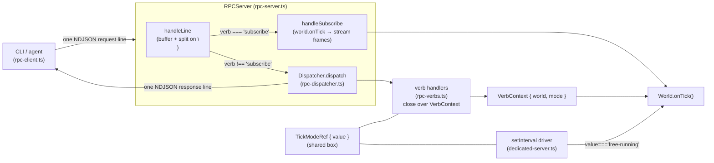

# The Command-RPC Control Plane (Headless Driving & the CLI)

## Purpose

This is the operator/agent control channel for a headless dedicated server: a tiny NDJSON-over-unix-socket RPC plane that lets an out-of-process CLI (or an agent) drive and inspect a running sim — list actors, read/mutate their state, single-step or free-run the tick loop, invoke whitelisted methods, and subscribe to a per-tick state stream. It is **orthogonal to replication**: replication is the game netcode that keeps clients in sync (see [./replication.md](./replication.md)); Command-RPC is an side-channel for tooling and verification. The two never touch — `World` exposes `tick()`/`onTick()` and the RPC plane sits beside it. For where this fits among the listen-server / dedicated-server / client process layouts, see [./runtime-topologies.md](./runtime-topologies.md).

## Mental model

Three strictly-separated layers plus one deliberate carve-out.

1. **Protocol codec** (`src/core/rpc-protocol.ts`) — pure wire types (`Request`, `Response`, `ErrorCode`) and NDJSON encode/decode functions. One JSON object per line; `\n` is the only frame delimiter. No I/O, no logic beyond `JSON.stringify`/`parse` and shape validation.
2. **Dispatcher registry** (`src/core/rpc-dispatcher.ts`) — a pure `Map<verb, Handler>` that awaits the handler, wraps a return value into `{ok:true, result}`, and converts a thrown `RPCError` into `{ok:false, error, code}` (specific code) or any plain `Error` into `VERB_FAILED`. **Never throws out of `dispatch`.** No socket dependency, so the verbs are unit-testable against a bare `Dispatcher`.
3. **Verbs** (`src/core/rpc-verbs.ts`) — `registerVerbs(dispatcher, ctx)` registers the seven request-reply verbs (`list`, `inspect`, `mutate`, `pause`, `resume`, `call`, `tick`) as closures over one `VerbContext { world, mode }`.[^six-verbs]
4. **Transport** — `src/core/rpc-server.ts` is the `Bun.listen` unix-socket host; `src/core/rpc-client.ts` is the spawn-act-exit client. The server buffers bytes, splits on `\n`, and for each line either dispatches (request-reply) or — for `verb === 'subscribe'` only — registers a `world.onTick` listener **inline, bypassing the Dispatcher** (the streaming carve-out).

[^six-verbs]: The in-source doc comment at `rpc-verbs.ts:17` calls these "the six Plan 2 verbs", but that comment is stale — **seven** request-reply verbs are registered (`list`, `inspect`, `mutate`, `pause`, `resume`, `call`, `tick`). Trust the registrations, not the comment.

The other key idea: **tick mode lives outside `World`**, in a shared mutable `TickModeRef` box created at server boot. `World` has no concept of pause — it only exposes `tick()`. The free-running driver is a `setInterval` in `dedicated-server.ts` that calls `world.tick()` only when `mode.value === 'free-running'`; `pause`/`resume` just flip the flag, and the `tick` verb (manual stepping) is gated to run only when paused, so the interval driver and manual stepping never both advance the world.



## Key types & APIs

### Protocol (`src/core/rpc-protocol.ts`)

```ts
// src/core/rpc-protocol.ts:13
export interface Request {
  id: number; // client-chosen correlation id, echoed back
  verb: string; // routed by this string
  args: Record<string, unknown>; // verb-specific args
}

// src/core/rpc-protocol.ts:23
export type ErrorCode =
  | "UNKNOWN_VERB"
  | "INVALID_ARGS"
  | "UNKNOWN_ACTOR"
  | "PATH_NOT_FOUND"
  | "VERB_FAILED"
  | "INTERNAL"
  | "METHOD_NOT_CALLABLE";

// src/core/rpc-protocol.ts:40 — a 4-arm union with TWO discriminants
export type Response =
  | { id: number; ok: true; result: unknown }
  | { id: number; ok: false; error: string; code: ErrorCode }
  | { id: number; stream: true; line: unknown } // streaming data frame
  | { id: number; stream: false; end: true }; // end-of-stream sentinel
```

Codec functions (each appends exactly one trailing `\n`):

```ts
// src/core/rpc-protocol.ts:47, :52
export function encodeRequest(req: Request): string; // JSON.stringify(req) + '\n'
export function encodeResponse(res: Response): string; // JSON.stringify(res) + '\n'

// src/core/rpc-protocol.ts:57, :62
export function encodeStreamFrame(id: number, line: unknown): string; // {id, stream:true, line}
export function encodeStreamEnd(id: number): string; // {id, stream:false, end:true}

// src/core/rpc-protocol.ts:67, :82
export function decodeRequest(line: string): Request; // throws on bad shape
export function decodeResponse(line: string): Response; // throws on bad shape
```

`decodeRequest` (`src/core/rpc-protocol.ts:67`) validates in order: result is a non-null object → `id` is `number` → `verb` is `string` → if `args === undefined` default it to `{}` → `args` must be a non-null object. Any violation throws (the server maps that throw to an `INTERNAL` response). `decodeResponse` (`src/core/rpc-protocol.ts:82`) requires a non-null object, numeric `id`, and at least one of `ok`/`stream` being a boolean — it must **not** assume `ok` is present, because stream frames omit it.

### Dispatcher (`src/core/rpc-dispatcher.ts`)

```ts
// src/core/rpc-dispatcher.ts:9 — throw this for a specific error code
export class RPCError extends Error {
  constructor(message: string, public readonly code: ErrorCode)
}

// src/core/rpc-dispatcher.ts:18
export type Handler = (args: Record<string, unknown>) => unknown | Promise<unknown>

// src/core/rpc-dispatcher.ts:25
export class Dispatcher {
  register(verb: string, handler: Handler): void        // throws if verb already registered
  async dispatch(req: Request): Promise<Response>       // never throws
}
```

`register` (`src/core/rpc-dispatcher.ts:28`) throws `verb already registered: <verb>` on a duplicate key — a boot-time guard against double registration. `dispatch` (`src/core/rpc-dispatcher.ts:35`) is the error-wrapping policy in code:

```ts
// src/core/rpc-dispatcher.ts:35
async dispatch(req: Request): Promise<Response> {
  const handler = this.handlers.get(req.verb)
  if (!handler) {
    return { id: req.id, ok: false, error: `unknown verb: ${req.verb}`, code: 'UNKNOWN_VERB' }
  }
  try {
    const result = await handler(req.args)
    return { id: req.id, ok: true, result }
  } catch (e) {
    if (e instanceof RPCError) {
      return { id: req.id, ok: false, error: e.message, code: e.code }
    }
    const msg = e instanceof Error ? e.message : String(e)
    return { id: req.id, ok: false, error: msg, code: 'VERB_FAILED' }
  }
}
```

### Verbs & context (`src/core/rpc-verbs.ts`)

```ts
// src/core/rpc-verbs.ts:9 — tick mode is a mutable box, not a value
export type TickMode = "free-running" | "paused";
export interface TickModeRef {
  value: TickMode;
}

// src/core/rpc-verbs.ts:12
export interface VerbContext {
  world: World;
  mode: TickModeRef;
}

// src/core/rpc-verbs.ts:20
export function registerVerbs(dispatcher: Dispatcher, ctx: VerbContext): void;
```

The seven verbs and what each returns / how it fails:

| Verb      | Args                        | Success result                                              | Failure code(s)                                                      |
| --------- | --------------------------- | ----------------------------------------------------------- | -------------------------------------------------------------------- |
| `list`    | —                           | `world.actors.map(a => ({ id, type: a.constructor.name }))` | —                                                                    |
| `inspect` | `id: string`                | `actor.state() ?? null`                                     | `INVALID_ARGS`, `UNKNOWN_ACTOR`                                      |
| `mutate`  | `path: string`, `value`     | `{ before, after }`                                         | `INVALID_ARGS`, `UNKNOWN_ACTOR`, `PATH_NOT_FOUND`                    |
| `pause`   | —                           | `{ mode: 'paused' }`                                        | —                                                                    |
| `resume`  | —                           | `{ mode: 'free-running' }`                                  | —                                                                    |
| `call`    | `actorId`, `method`, `args` | `fn.apply(actor, args) ?? null`                             | `UNKNOWN_ACTOR`, `METHOD_NOT_CALLABLE`, `VERB_FAILED` (method throw) |
| `tick`    | `n: positive int`           | `{ advanced: n, frame, simTime }`                           | `VERB_FAILED` (wrong mode), `INVALID_ARGS` (bad `n`)                 |

### Supporting types

```ts
// src/core/actor.ts:51 — the per-class call allowlist
static readonly callable: readonly string[] = []

// src/core/actor.ts:63 — what inspect / the snapshot read
state(): TState | undefined { return undefined }

// src/verification/state-snapshot.ts:3 — the subscribe stream's per-frame `line`
export interface StateSnapshot {
  frame: number
  simTime: number
  localFrameOrigin: { x: number; y: number; z: number }
  actors: Record<string, unknown>       // a.state() keyed by a.id, only when non-undefined
  actorTimings: Record<string, number>  // world.actorUpdateMs[i] keyed by a.id
}

// src/core/rpc-server.ts:31 — per-connection state stashed on sock.data
interface SocketState {
  buf: string                  // partial-line accumulator
  subs: Map<number, () => void> // subscribe id -> onTick disposer
}
```

`World`'s relevant surface (`src/core/world.ts`): `tick()` (`:195`), `frame` (`:30`), `simTime` (`:26`), `currentTick` (`:32`), and the listener registry `onTick(cb): () => off` (`:35`). Crucially, **`World` has no pause flag** — the only tick-related state it owns is the counters and the `onTick` listener list.

## Data-flow walkthrough

### Request-reply path (`inspect freighter`)

1. **CLI** parses argv into `{ sockPath, verb, args }` and calls `sendRequest(sockPath, { id, verb: 'inspect', args: { id: 'freighter' } })` (`src/core/rpc-client.ts:12`).
2. **Client** `Bun.connect({ unix: sockPath })`; on `open` it writes `encodeRequest(req)` — one NDJSON line (`src/core/rpc-client.ts:19`).
3. **Server** `socket.data` appends `chunk.toString()` to the per-socket `buf` and loops `indexOf('\n')`, slicing each complete line; empty lines (`line.length === 0`) are skipped; each non-empty line goes to `handleLine` (`src/core/rpc-server.ts:55`).
4. `handleLine` runs `decodeRequest(line)`. On a decode throw it writes `{ id: -1, ok: false, error: 'malformed request: <msg>', code: 'INTERNAL' }` and returns — the **only** place `INTERNAL` is produced, and `id` is `-1` because decoding never recovered the real id (`src/core/rpc-server.ts:86`).
5. `verb !== 'subscribe'`, so `handleLine` awaits `dispatcher.dispatch(req)` and writes `encodeResponse(response)` (`src/core/rpc-server.ts:101`).
6. **Dispatcher** looks up `inspect`; present, so it awaits the handler (`src/core/rpc-dispatcher.ts:36`).
7. The `inspect` handler (`src/core/rpc-verbs.ts:25`) calls `requireString(args, 'id')`, finds the actor by `id`, throws `RPCError('no actor...', 'UNKNOWN_ACTOR')` if missing, else returns `actor.state() ?? null`.
8. Dispatcher wraps the return into `{ id, ok: true, result }` (`src/core/rpc-dispatcher.ts:42`).
9. Server writes that as one NDJSON line back to the socket.
10. **Client** `data` callback accumulates bytes, finds the first `\n`, slices the line, sets `settled = true`, `resolve(decodeResponse(line))`, then `sock.end()` in `finally` (`src/core/rpc-client.ts:22`). The CLI acts on the resolved `Response` and the process exits. This is spawn-act-exit: one request, one response line, close.

### Streaming path (`subscribe`)

1. Client writes `{ id, verb: 'subscribe', args: {} }` exactly as above.
2. In `handleLine`, `req.verb === 'subscribe'` so it calls `handleSubscribe(sock, req.id)` and returns — **the Dispatcher is never involved** (`src/core/rpc-server.ts:96`).
3. `handleSubscribe` (`src/core/rpc-server.ts:107`): if `state.subs` already holds this `id`, write `{ ok: false, code: 'INVALID_ARGS', error: 'duplicate subscription id on this socket' }` and return. Otherwise register `off = world.onTick(() => { const line = snapshot(world); try { sock.write(encodeStreamFrame(id, line)) } catch { /* swallow */ } })` and store `off` under `id`. **No immediate response is sent** — the client gets nothing until the next `world.tick()`.
4. The **free-running driver** in `dedicated-server.ts:246-249` (`setInterval(1000 / hz)`) calls `world.tick()` whenever `mode.value === 'free-running'`. (When paused, the `tick` verb is the only thing that advances the world.)
5. Each `world.tick()` fires all `onTick` listeners at the bottom of the tick — after counters increment (`src/core/world.ts:223-225`). The subscription listener builds `snapshot(world)` (`src/verification/state-snapshot.ts:25`) and writes one `{ id, stream: true, line }` frame per tick.
6. On socket close, the `close` handler iterates `subs`, calls each disposer (try/catch), best-effort writes `encodeStreamEnd(id)` per sub (try/catch — the socket is already closing), then clears the map (`src/core/rpc-server.ts:65`).

```
 free-running driver           subscriber socket
 ──────────────────            ─────────────────
 setInterval(1000/hz)
   │  mode==='free-running'?
   ▼  yes → world.tick()
   ├─ apply (top)
   ├─ tick groups
   ├─ collect+flush (replication, unrelated)
   ├─ frame++, currentTick++
   └─ onTick listeners ────────► snapshot(world) → {stream:true,line}  (one per tick)
                          ...
 socket close ──────────────────► dispose off(); {stream:false,end:true}
```

## Invariants & gotchas

- **One request, one response, per line.** `\n` is the only delimiter. `Bun.listen` may deliver partial or multiple lines in one `data` callback, so both ends buffer-and-split (`SocketState.buf` on the server, `buf` in the client closure). Never assume one chunk equals one frame.
- **`subscribe` is the only verb not routed through the Dispatcher.** It is matched by string in `handleLine` (`src/core/rpc-server.ts:96`) and handled inline so the server can own the long-lived subscription lifecycle (keep the socket open, emit per tick, clean up on close). The Dispatcher therefore stays strictly request-reply and stays unit-testable without a socket.
- **`subscribe` sends no acknowledgement.** The first byte the client sees is the next tick's frame. A subscription registered after some ticks have fired misses those ticks by design.
- **Tick mode lives in the server layer, not `World`.** `pause`/`resume` only mutate `ctx.mode.value` (`src/core/rpc-verbs.ts:63-71`). The actual gating is the `setInterval` in `dedicated-server.ts:246-249` skipping `world.tick()` when not free-running. Because `TickModeRef` is a **shared object reference**, the verb closures and the interval driver observe each other's writes — pass the box, never a copy.
- **`tick` verb has two failure modes with different codes.** Wrong mode throws a **plain `Error`** (`'tick verb requires paused mode — call pause first'`) → `VERB_FAILED`; a bad `n` (non-number / non-finite / `<= 0` / non-integer) throws an **`RPCError`** → `INVALID_ARGS` (`src/core/rpc-verbs.ts:95-102`). The gate to paused mode exists precisely so the interval driver and manual stepping never both advance the world.
- **`call` gating order is: actor exists (`UNKNOWN_ACTOR`) → method is in the static `callable` allowlist (`METHOD_NOT_CALLABLE`) → property is actually a function (`METHOD_NOT_CALLABLE` again) → invoke** (`src/core/rpc-verbs.ts:79-92`). The allowlist is read off `actor.constructor.callable` (per-class static, default `[]`, `src/core/actor.ts:51`). A method that exists on the actor but is absent from `callable` is rejected.
- **`call` does not catch the invoked method's own throws.** They propagate to the Dispatcher and become `VERB_FAILED` with the original message preserved (`src/core/rpc-verbs.ts:92` returns `fn.apply(...) ?? null` with no surrounding try/catch).
- **`mutate` uses `in` semantics, not truthiness.** It detects a provided value with `'value' in args` (so writing `false`/`0`/`null`/`''` works) and checks the final field with `field in parent` (so existing-but-`undefined` fields are writable). A `null`/`undefined` **intermediate** on the path is `PATH_NOT_FOUND`. The path must have at least one field part after the actor id (`<actor-id>.<field>`), else `INVALID_ARGS` (`src/core/rpc-verbs.ts:32-60`).
- **`undefined` results are normalized to `null`.** `inspect` returns `actor.state() ?? null`; `call` returns `fn.apply(...) ?? null` — so the JSON `result` field is always present.
- **No flow control on streaming.** A stalled subscriber accumulates unbounded send-buffer memory (explicitly acknowledged as acceptable for the expected 1-2 agent subscribers, `src/core/rpc-server.ts:116`). The per-frame write is wrapped in try/catch so a dead socket mid-write doesn't throw out of the tick loop; the `close` handler does the real cleanup.
- **Socket-file hygiene.** `listen` unlinks a stale socket file first (else `Bun.listen` `EADDRINUSE`, `src/core/rpc-server.ts:49`) and `close` unlinks it again (`src/core/rpc-server.ts:131`).
- **Duplicate subscription ids are per-socket.** The same id on two different sockets is independent; the duplicate guard is keyed in `SocketState.subs`.
- **The protocol is unversioned.** Single-peer — one CLI talking to one server in the same codebase — so there is no capability negotiation. A multi-peer port would need to add it.

## Porting to haystack

haystack is Bun + Hono + a React/react-three-fiber + three.js client; mars is Bun + vanilla three + Rapier + a unix-socket RPC. The control plane maps over cleanly, with one transport substitution:

- **Reuse the three-layer split verbatim.** A pure codec (no I/O), a pure `Dispatcher` (no I/O, never throws out of `dispatch`), and a thin transport doing framing + the `subscribe` carve-out. This is exactly what makes the verbs unit-testable against a `Dispatcher` without a real socket. Keep it.
- **Keep `Response` a 4-arm union with two discriminants** (`ok` for request-reply, `stream` for streaming). `decodeResponse` must accept either — stream frames omit `ok`.
- **Preserve the exact error-code policy.** `UNKNOWN_VERB` is produced by the Dispatcher; `INTERNAL` only at the transport for a malformed line (with `id: -1`); `VERB_FAILED` is the catch-all for any thrown plain `Error`; every other specific code (`INVALID_ARGS`, `UNKNOWN_ACTOR`, `PATH_NOT_FOUND`, `METHOD_NOT_CALLABLE`) must come from an `RPCError` raised inside a handler. Reproduce the `tick` subtlety: wrong-mode is a plain `Error` (`VERB_FAILED`), bad-`n` is `RPCError` (`INVALID_ARGS`).
- **Tick mode must be a shared mutable `{ value }` box**, not a passed-by-copy value, because the driver loop and the verb closures must see each other's writes. Put the free-running loop in the host and gate it on `mode.value === 'free-running'`; make `pause`/`resume` only flip the flag; keep your `World` pause-agnostic; gate the `tick` verb to paused mode so the two never both advance the world. In haystack this driver is a host-side loop (the dedicated server process), not the rAF render loop — the render loop drives the _client_ world and is unrelated to this operator channel.
- **Transport substitution (the main divergence).** mars uses a `Bun.listen` **unix socket** with a spawn-act-exit `Bun.connect` client. haystack already runs a Hono server, so the natural fit is a **WebSocket route on Hono** (or, if you want the same agent-CLI ergonomics, keep a unix socket via `Bun.listen` purely for the control plane). Either way: frame on `\n` on both ends because Bun can coalesce/fragment writes; append exactly one trailing newline per encoded frame; skip empty lines on decode. If you go WebSocket, message-framing is already per-message and you can skip the manual `\n` split — but keep the `Request`/`Response` JSON shapes unchanged so the same codec serves both. Do not entangle this with replication's WebSocket: replication is binary game netcode (see [./replication.md](./replication.md)), this is JSON tooling traffic; keep them on separate routes/sockets.
- **`subscribe` must be intercepted by verb name in the transport, before the Dispatcher**, and register against `world.onTick` (which returns a disposer). Emit your snapshot as the `line` each tick; send no synchronous ack; store the disposer per-connection keyed by request id; reject a duplicate id on the same connection with `INVALID_ARGS`; on close, dispose every listener and best-effort emit the end sentinel. In haystack the snapshot is whatever the React/r3f inspection surface needs — adapt `StateSnapshot` to your actor `state()` shapes.
- **`call` allowlist is per-class static**, read via `actor.constructor.callable` (default `[]`). Enforce membership _before_ touching the method, then verify it's a function, then invoke; do not catch the method's own throws; normalize `undefined` returns to `null`.
- **Socket lifecycle** (only if you keep a unix socket): unlink stale on listen to avoid `EADDRINUSE`, unlink on close. A WebSocket route on Hono needs none of this.

### Open items inherited from mars

- No protocol versioning / capability negotiation (deferred). A multi-peer haystack control plane would need it.
- Streaming has no backpressure; a slow subscriber grows the send buffer unbounded. Fine for 1-2 agents.
- `subscribe` takes no args and always snapshots the whole world every tick — no actor filtering or frame rate-limiting.

---

See also: [./runtime-topologies.md](./runtime-topologies.md) · [./replication.md](./replication.md) · [./world-and-actors.md](./world-and-actors.md) · [./client-side-prediction.md](./client-side-prediction.md) · [./README.md](./README.md)
