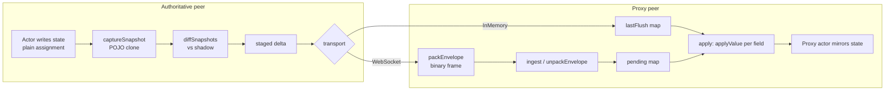

# State Replication: Shadow-Diffing, the Binary Envelope, and Transports

> Reference implementation: **mars** (`/Users/hv/repos/mars`). Citations are `src/<path>:<line>` relative to the mars repo root. haystack diverges where noted under [Porting to haystack](#6-porting-to-haystack).
>
> Sibling docs: [world & actors / roles](./world-and-actors.md) · [client-side prediction / the ack path](./client-side-prediction.md) · [command RPC](./command-rpc.md) · [runtime topologies](./runtime-topologies.md) · [README](./README.md)

## 1. Purpose

The replication plane carries authoritative actor state from the peer that owns the simulation to the peers that only render it. It is the layer between the **World tick loop** (which produces final per-tick state) and the **transport** (in-process loopback, or a WebSocket). It is observation-driven: actors write their state with plain assignment, and the driver detects what changed by diffing each tick's capture against a stored "shadow." This doc covers the `NetDriver` contract, the `replicatedProperties` manifest, the shadow-diff algorithm, the exact binary net-envelope layout, the in-memory loopback path, the per-peer WebSocket server driver, the client ingest/apply path, and the clean split between binary replication frames and JSON control messages.

For where `Role` comes from and how proxies fit the actor lifecycle, see [./world-and-actors.md](./world-and-actors.md). For how `ackClientTick` closes the prediction loop, see [./client-side-prediction.md](./client-side-prediction.md).

## 2. Mental model

Each `Actor` subclass declares a **static** `replicatedProperties` manifest: an array of `ReplicatedField` descriptors, each naming a field, its value family (`scalar | vec3 | quat`), a `get` reader, and an optional `set` writer (`src/core/replication.ts:16`). There is **no `markDirty`**. The driver discovers changes by comparing each tick's freshly captured snapshot to a per-actor shadow.



The flow ties into the tick loop at two fixed points (`src/core/world.ts:195`):

```
World.tick():
  apply()              ← TOP    (proxies see freshest server state before their update)
  PrePhysics → Physics → PostPhysics → PostUpdateWork   (actor.update(dt))
  collect(authoritative) ; flush()   ← BOTTOM (outgoing state is post-everything)
  frame++ ; currentTick++ ; onTick listeners fire
```

`collect`/`flush` run over **only `role === Authoritative`** actors at the bottom; `apply` runs at the top of the _next_ tick — so a proxy mirrors authoritative state one tick later in wall time, but within a single client animation frame `apply` (tick top) precedes the render (after `step()` returns).

Two concrete drivers implement the same `NetDriver` interface:

- **`InMemoryNetDriver`** — listen-server loopback. Staged deltas are handed straight to in-process proxy actors. No encoding (`src/core/in-memory-driver.ts`).
- **`WebSocketNetDriver`** (server) + **`WebSocketClientDriver`** (client) — real multiplayer. The server keeps **one shadow per peer** and serializes deltas through the binary net-envelope; the client decodes and routes them to proxy receivers (`src/runtime/websocket-net-driver.ts`, `src/runtime/websocket-client-driver.ts`).

## 3. Key types & APIs

### The driver contract

```ts
// src/core/net-driver.ts:16
export interface NetDriver {
  register(actor: Actor): void;
  unregister(actor: Actor): void;
  collect(authoritativeActors: readonly Actor[]): void;
  flush(): void;
  apply(): void;
  readonly lastFlush: ReadonlyMap<string, ReplicatedSnapshot>;
}
```

`register` seeds an initial shadow so the next `collect` yields a full diff. `collect` observes every authoritative actor and stages the dirty set. `flush` delivers it. `apply` consumes inbound state on receiving peers. `lastFlush` is the last flushed dirty set keyed by actor id, exposed for tests and future RPC `inspect` verbs (`src/core/net-driver.ts:37`).

> **`registerReceiver` is NOT part of `NetDriver`.** It is an extra concrete method on `InMemoryNetDriver` (`src/core/in-memory-driver.ts:42`) and `WebSocketClientDriver` (`src/runtime/websocket-client-driver.ts:43`) used to wire a proxy actor as a delta sink.

### The replication primitives

```ts
// src/core/replication.ts:14
export type ReplicatedType = "scalar" | "vec3" | "quat";

// src/core/replication.ts:16
export interface ReplicatedField {
  name: string; // wire/snapshot key, unique per actor
  type: ReplicatedType; // drives clone/equal + wire byte size
  get: (actor: unknown) => unknown; // live reader, called every tick
  set?: (actor: unknown, value: ReplicatedValue) => void; // optional writer
}

// src/core/replication.ts:34
export type ReplicatedScalar = number;
export type ReplicatedVec3 = { x: number; y: number; z: number };
export type ReplicatedQuat = { x: number; y: number; z: number; w: number };
export type ReplicatedValue = ReplicatedScalar | ReplicatedVec3 | ReplicatedQuat;
export type ReplicatedSnapshot = Record<string, ReplicatedValue>;
```

Snapshots are plain POJOs keyed by field name. `vec3`/`quat` are plain `{x,y,z[,w]}` objects, **not** THREE objects — `captureSnapshot` strips them (`src/core/replication.ts:52-58`). There is **no per-field serialize/deserialize/quantize function**: serialization is centralized in net-envelope and keyed off `type`. `set` is optional; when omitted, the apply path uses defaults (see [§3 apply](#the-apply-write-path)).

### The manifest (static on the class)

```ts
// src/core/actor.ts:43
static readonly replicatedProperties: readonly ReplicatedField[] = []
```

The manifest lives on the actor's **constructor**, not the instance. Drivers read it via `actor.constructor.replicatedProperties` (`src/core/in-memory-driver.ts:84`, `src/runtime/websocket-net-driver.ts:56`). The empty default keeps non-replicating actors inert on the wire.

The canonical multi-field example is `FreighterActor.replicatedProperties` (`src/actors/freighter/freighter-actor.ts:144`) — **11 fields**: `pos` (vec3), `quat` (quat), `linVel` (vec3), `angVel` (vec3) with **no** `set` (default writer), plus 7 command scalars (`mainThrottle`, `strafeXCmd`, `strafeYCmd`, `strafeZCmd`, `pitchCmd`, `yawCmd`, `rollCmd`) **with** a custom `set` that writes into the nested `command` object, e.g.:

```ts
// src/actors/freighter/freighter-actor.ts:165
{ name: 'mainThrottle', type: 'scalar',
  get: (a: any) => (a as FreighterActor).command.main,
  set: (a: any, v) => { (a as FreighterActor).command.main = v as number } }
```

So one manifest mixes both writer paths. `pos`/`quat` are read off `mesh.group.position`/`mesh.group.quaternion` (`src/actors/freighter/freighter-actor.ts:148,153`); `linVel`/`angVel` off internal mirrors `_replicatedLinVel`/`_replicatedAngVel` (`src/actors/freighter/freighter-actor.ts:158,163`).

### The wire codec types

```ts
// src/core/net-envelope.ts:31
const FIELD_BYTES: Record<"scalar" | "vec3" | "quat", number> = { scalar: 8, vec3: 24, quat: 32 }; // 1/3/4 × f64 LE

// src/core/net-envelope.ts:85
export interface UnpackedActor {
  snapshot: ReplicatedSnapshot;
  bytesConsumed: number;
}

// src/core/net-envelope.ts:144
export interface DecodedEnvelope {
  tick: number;
  ackClientTick: number;
  entries: Map<string, ReplicatedSnapshot>;
}
```

### Capture / diff

```ts
// src/core/replication.ts:43
export function captureSnapshot(
  actor: unknown,
  descriptors: readonly ReplicatedField[],
): ReplicatedSnapshot;
// src/core/replication.ts:65
export function diffSnapshots(
  current: ReplicatedSnapshot,
  shadow: ReplicatedSnapshot,
): ReplicatedSnapshot;
```

`captureSnapshot` reads each descriptor's `get`, deep-cloning vec3/quat into plain `{x,y,z[,w]}` (`src/core/replication.ts:48-59`). `diffSnapshots` walks `Object.keys(current)`; a field is dirty if its shadow entry is `undefined` (first capture) **or** `!equalValue(c, s)` (`src/core/replication.ts:70-77`). `equalValue` is **exact `===` per component, no epsilon** (`src/core/replication.ts:86-91`).

### The apply write path

Both drivers share an identical `applyValue` (`src/core/in-memory-driver.ts:89`, `src/runtime/websocket-client-driver.ts:119`):

```ts
function applyValue(target, desc, value) {
  if (desc.set) {
    desc.set(target, value);
    return;
  } // 1. custom (nested fields)
  if (desc.type === "scalar") {
    target[desc.name] = value;
    return;
  } // 2. scalar assign
  const field = desc.get(target); // 3. live Vector3/Quaternion
  if (desc.type === "vec3")
    field.set?.(v.x, v.y, v.z); //    write in place via .set
  else field.set?.(q.x, q.y, q.z, q.w);
}
```

Resolution priority: custom `set` → scalar assignment → `desc.get(target).set(...)` for vec3/quat. The vec3/quat path **mutates the existing object in place** and is guarded by `typeof field.set === 'function'` — if `get` returns something without `.set`, the write is silently dropped.

## 4. Data-flow walkthrough

### 4a. End to end: an authoritative `pos`/`quat` change reaches a SimulatedProxy (WebSocket)

1. **Server tick top** (`src/core/world.ts:202`): `netDriver.apply()` runs. On the server this is `WebSocketNetDriver.apply()`, a deliberate **no-op** (`src/runtime/websocket-net-driver.ts:118`) — the server is authoritative, nothing inbound.
2. **Update groups run.** The authoritative `FreighterActor.update()` reads its pose back from Rapier into `mesh.group.position`/`quaternion` and into the `linVel`/`angVel` mirrors. This is where the new replicated values land on the actor.
3. **Server tick bottom** (`src/core/world.ts:217-220`): `auth = actors.filter(role === Authoritative)`; `collect(auth)`; `flush()`.
4. **`collect`** (`src/runtime/websocket-net-driver.ts:86`): clears `lastCapture`, then for each authoritative actor with known descriptors, `lastCapture.set(id, captureSnapshot(a, descs))`. The capture deep-clones vec3/quat into POJOs (`src/core/replication.ts:52-58`).
5. **`flush`** (`src/runtime/websocket-net-driver.ts:95`) — the per-peer shadow diff. For each `[peerId, shadow]`:
   - skip the actor if `ownerOf(actorId) === peerId` (`:102`);
   - `peerShadow = shadow.get(actorId) ?? {}` (`:103`) — an empty map means first capture → full baseline;
   - `delta = diffSnapshots(current, peerShadow)` (`:104`) — only genuinely-changed fields (e.g. `pos` + `quat`) appear;
   - if `delta` has keys, stage it (`:105-107`);
   - **always** `shadow.set(actorId, current)` to advance this peer's shadow (`:108`).
6. If `deltas.size > 0` (`:110`): `ack = peerAckTick.get(peerId) ?? 0`; `bytes = packEnvelope(this.tick, ack, deltas, this.descs)`; `this.opts.send(peerId, bytes)` — emitted as a **binary** WS frame.
7. **Encode** (`packEnvelope`, `src/core/net-envelope.ts:152`): 10-byte header + length-prefixed per-actor entries (full layout in [§4b](#4b-the-binary-net-envelope-byte-layout)).
8. **Client receive** (`multiplayer-client` onMessage): branches on `typeof event.data`. An `ArrayBuffer` → `driver.ingest(new Uint8Array(data))`.
9. **`ingest`** (`src/runtime/websocket-client-driver.ts:60`): `unpackEnvelope(bytes, id => this.descs.get(id) ?? null)`. Sets `lastTick = max(lastTick, envelope.tick)`. For each `[id, delta]`, merges field-by-field into `pending` (latest field wins) and records `pendingMeta[id] = {tick, ackClientTick}` keeping the highest tick (`:71-74`).
10. **Client tick top** (`src/core/world.ts:202`): `WebSocketClientDriver.apply()` (`src/runtime/websocket-client-driver.ts:86`) drains `pending`. For the remote freighter's **SimulatedProxy** receiver (`role !== AutonomousProxy`), for each descriptor present in the delta it calls `applyValue` (`:99-103`).
11. **`applyValue`** writes `pos`/`quat` via the default path (`field.set(...)` on the live `mesh.group.position`/`quaternion`); the command scalars use their custom `set`.
12. **Proxy update.** Still inside the same client tick, the proxy `FreighterActor.update()` runs its non-autonomous branch. A SimulatedProxy has no Rapier body, so the read-back block is skipped — it does **not** clobber the just-applied pose.
13. **Render.** After `world.step(wallDt)` returns, the renderer draws the scene in the **same** animation frame. The applied pose (written at tick top) is on screen that frame.

### 4b. The binary net-envelope byte layout

The envelope (`packEnvelope` / `unpackEnvelope`, `src/core/net-envelope.ts`) has a fixed **10-byte header** followed by length-prefixed per-actor entries. **No magic number, no version field.** All numerics little-endian; tick/ack coerced with `>>> 0` (`src/core/net-envelope.ts:162-163`).

```
ENVELOPE
 byte 0           4           8     10
      ┌───────────┬───────────┬─────┬───────────────── entries ─────────────────┐
      │ tick u32  │ ackClient │ cnt │  entry[0]  entry[1]  ...  entry[cnt-1]     │
      │   LE      │ Tick u32LE│ u16 │                                            │
      └───────────┴───────────┴─────┴────────────────────────────────────────────┘
        @0          @4          @8        cnt = entryCount (backfilled @8)

ENTRY  (one per actor with resolvable descriptors)
      ┌──────────┬─────────────┬──────────────┬──────────────────────────────┐
      │ idLen    │ id (UTF-8)  │ payloadLen   │ actor payload                │
      │ u16 LE   │ idLen bytes │ u32 LE       │ payloadLen bytes (see below) │
      └──────────┴─────────────┴──────────────┴──────────────────────────────┘

ACTOR PAYLOAD  (packActorSnapshot, src/core/net-envelope.ts:39)
      ┌────────────┬───────────────────────┬───────────────────────────────────┐
      │ fieldCount │ dirty bitmask         │ field values (set bits only,      │
      │ u8         │ ceil(N/8) bytes       │  descriptor order, f64 LE)        │
      │            │ LSB-first per byte    │  scalar 8B · vec3 24B · quat 32B  │
      └────────────┴───────────────────────┴───────────────────────────────────┘
        N = descs.length
        bit i set  ⟺  descs[i].name ∈ snapshot   (mask[i>>3] |= 1 << (i&7))
```

**Encode order** (`src/core/net-envelope.ts:152`): write header with `tick`@0, `ackClientTick`@4, entryCount@8 _deferred_; for each entry whose descriptors resolve via `descsByActor`, push `[idLen u16][id][payloadLen u32][packActorSnapshot]` and `entryCount++`; entries with no descriptors are **skipped** (not counted); finally backfill `entryCount`@8 and concatenate. Throws if id > 65535 bytes (`:172`) or entryCount > 65535 (`:183`).

**`packActorSnapshot`** (`src/core/net-envelope.ts:39`): throws if `descs.length > 255` (`:43`). First pass builds the bitmask and sums `payloadBytes` from `FIELD_BYTES`. `out[0] = descs.length`; mask copied at offset 1. Second pass writes, **in descriptor order**, each present field as f64 LE (scalar 1 value; vec3 x/y/z; quat x/y/z/w).

**Decode** (`unpackEnvelope`, `src/core/net-envelope.ts:201`): reject if `< 10` bytes. Read `tick`@0, `ackClientTick`@4, `count`@8; `cursor = 10`. Per entry, bounds-check then read `idLen`, `id`, `payloadLen`; call `resolveDescs(id)`. If descriptors known, `unpackActorSnapshotWithLen(bytes, descs, cursor)` and add to `entries`; **always** `cursor += payloadLen` (skip whether decoded or not). `unpackActorSnapshotWithLen` (`src/core/net-envelope.ts:100`) throws `descriptor count mismatch` if the wire `fieldCount` byte ≠ local `descs.length` (`:109`) — the **only** descriptor-drift guard.

### 4c. InMemory loopback (listen-server)

The listen-server skips all encoding. `InMemoryNetDriver` holds `shadows`, `staged`, `receivers` maps (`src/core/in-memory-driver.ts:22-24`).

- **`register`** (`:27`): `shadows[id] = {}`. The empty shadow forces the first `collect` to emit a full snapshot.
- **`collect`** (`:46`): `staged.clear()`; per authoritative actor, skip if no descriptors; if no shadow exists yet (collected before registered) do **two** independent `captureSnapshot` calls — one for the shadow, one staged — and `continue` (`:51-58`); otherwise `current = captureSnapshot`, `delta = diffSnapshots(current, shadow)`, stage the delta, and **advance** `shadows[id] = current` (`:59-63`). Shadow advancement happens inside `collect`, in the same call that produced the delta.
- **`flush`** (`:67`): `lastFlush = new Map(this.staged)` — a **shallow** copy (value objects shared by reference).
- **`apply`** (`:71`): for each `[id, delta]` in `lastFlush`, find the registered `receiver` (`registerReceiver`, `:42`), and for each descriptor present in the delta call `applyValue`. The receiver proxy shares the **same id string** as the authoritative actor.

### 4d. Two channels, one socket: binary frames vs JSON control

A single WebSocket carries two channels distinguished **only** by WS frame type — there is no binary discriminant (`src/runtime/wire-protocol.ts:5-15`). Both onMessage handlers branch on `typeof data === 'string'`.

**Binary frames** = net-envelope replication (§4b). **Text frames** = JSON `WireMessage`:

```ts
// src/runtime/wire-protocol.ts:73
export type WireMessage =
  | HelloMessage // :22  server→client, FIRST on open: { playerId, scene, tick }
  | SpawnMessage // :32  server→client: { actorId, className, ownerPlayerId, initialState }
  | DespawnMessage // :46  server→client: { actorId }
  | InputMessage // :53  client→server ONLY: { tick, command }
  | PeerJoinedMessage // :61  server→client notify: { playerId }
  | PeerLeftMessage; // :68  server→client notify: { playerId }
```

`encodeMessage` is `JSON.stringify` (`:83`); `decodeMessage` JSON-parses, then requires the parsed value to be a non-null `object` with a string `type` (throwing `decodeMessage: missing string type` otherwise, `:89-90`). It accepts the six known types and throws `decodeMessage: unknown message type '<type>'` for anything else (`:101`).

Wiring:

- **`SpawnMessage.initialState`** is a full `ReplicatedSnapshot` carried as **JSON, not binary** — spawns are rare, so simplicity beats bandwidth (`src/runtime/wire-protocol.ts:41`). The client constructs the proxy, attaches it, and calls `driver.registerReceiver` so `unpackEnvelope` can resolve its descriptors. The matching binary **baseline** still arrives on the next flush via the peer's empty per-peer shadow.
- **`DespawnMessage`** → `driver.unregisterReceiver` + `world.removeActor`.
- **`InputMessage`** travels **outside** the NetDriver. The client sends it as a text frame; the server routes it to the connection-owned freighter (`applyThrust`) and records `msg.tick` as that peer's `ackClientTick` via `setPeerAckTick` — which then rides back in the header of every binary envelope to that peer. See [./client-side-prediction.md](./client-side-prediction.md).
- **`peer-joined` / `peer-left`** are notification-only; the mechanical spawn/despawn arrives separately.

### 4e. Client apply routing by Role

`WebSocketClientDriver.apply()` (`src/runtime/websocket-client-driver.ts:86`) routes by `receiver.role`:

- **`AutonomousProxy`** (the local player's own ship): **does NOT write fields**. It stashes `lastServerFrames[id] = {tick, ackClientTick, snapshot: delta}` and continues (`:90-98`). The prediction code pulls it via `takeLastServerFrame(id)`, which is **single-shot** — returns the frame and deletes it (`:112`). Writing the fields here would clobber client-side prediction.
- **everything else** (SimulatedProxy): `applyValue` per descriptor present in the delta (`:99-103`).

After draining, `pending.clear()` + `pendingMeta.clear()` (`:105-106`).

## 5. Invariants & gotchas

- **`replicatedProperties` is static on the constructor.** An instance field would be invisible to `getDescriptors` / driver lookups (`src/core/in-memory-driver.ts:84`, `src/runtime/websocket-net-driver.ts:56`).
- **No `markDirty`.** Change detection is purely `captureSnapshot` + `diffSnapshots` at the tick boundary. A field changed and reverted within one tick produces **no** delta.
- **`equalValue` is exact `===`, no epsilon** (`src/core/replication.ts:86`). Any bit-level change in any component flags the whole field dirty, and the **whole** field is re-sent — there is no per-component delta.
- **`captureSnapshot` must deep-clone vec3/quat.** If the shadow aliased the live THREE object, an in-place `.set()` would silently mutate the shadow and hide future diffs (`src/core/replication.ts:52-58`).
- **Shadow advancement happens in `collect`, not `flush`.** `collect` both produces the delta and overwrites the shadow (`src/core/in-memory-driver.ts:59-63`; `src/runtime/websocket-net-driver.ts:104-108`). `flush` is a pure hand-off/promotion step. Run `collect` twice without an intervening mutation and the second yields an empty delta.
- **`register` seeds `{}`** so the first `collect` emits a full snapshot. The separate "no shadow" branch in `InMemoryNetDriver.collect` (`:51-58`) handles actors collected before `register` and does two independent captures.
- **`flush` is a shallow Map copy** (`src/core/in-memory-driver.ts:68`) — value objects are shared by reference between `staged` and `lastFlush`. Callers must not mutate them.
- **`apply` is field-sparse.** Only fields present in the delta are written (`desc.name in delta` guard); other proxy fields keep their previous values. It is **not** a full-state overwrite.
- **Default vec3/quat write mutates in place** via the live field's `.set(...)` and is guarded by `typeof field.set === 'function'`. If a proxy's `get` returns something without `.set`, the write is silently dropped. Nested targets **require** a custom `desc.set`.
- **The dirty bitmask indexes descriptor order, LSB-first** (`mask[i>>3] |= 1 << (i&7)`, `src/core/net-envelope.ts:52`). Pack and unpack must share the exact same descriptor array/order or fields decode into the wrong slots.
- **No magic, no version in the envelope.** The header is exactly 10 bytes. The only drift guard is the per-actor `fieldCount` byte, checked against local descriptor count (`src/core/net-envelope.ts:109`, throws `descriptor count mismatch`).
- **The per-actor `payloadLen` prefix is load-bearing.** `unpackEnvelope` advances `cursor += payloadLen` even when `resolveDescs` returns null (`src/core/net-envelope.ts:239`), so an actor whose Spawn hasn't been processed is stepped over without needing its field types. This is why client `ingest` tolerates frames for not-yet-registered receivers.
- **Wire is float64 throughout. No quantization yet** (`src/core/net-envelope.ts:28`). Despite the manifest mentioning `type`, there is no quantize hook anywhere.
- **`tick`/`ackClientTick` are coerced `>>> 0`** on encode (`src/core/net-envelope.ts:162-163`). Values > 2³²−1 wrap silently.
- **Hard limits enforced by throws:** 255 fields per actor (u8 count), 65535 bytes per actor id, 65535 entries per envelope.
- **Per-peer shadow is the whole point of the server driver.** `peerShadows: Map<peerId, Map<actorId, snapshot>>` (`src/runtime/websocket-net-driver.ts:37`). A peer joining mid-game starts with an empty shadow (`addPeer`, `:74`), so `diffSnapshots` treats every field as changed and the joiner gets a **full baseline** while existing peers get small deltas on the same flush.
- **`flush` always advances each peer's shadow, even when the delta is empty** (`src/runtime/websocket-net-driver.ts:108`). Otherwise unchanged values would be re-sent forever. No frame is sent when a peer has no deltas (`:110`).
- **Owner-skip is a latent optimization, currently disabled.** `flush` skips an actor for a peer when `ownerOf(actorId) === peerId` (`:102`), but the dedicated server injects `ownerOf: () => null`, so nothing is ever skipped — every peer (including the owner) gets replication for its own freighter. Owner-skip only pays off once client-side prediction owns the local copy; until then the owning client is a pure proxy and would never move visually without the server's state.
- **`AutonomousProxy` is stashed, never written** by client `apply` (`src/runtime/websocket-client-driver.ts:90`). Only `takeLastServerFrame` exposes it, single-shot.
- **`InputMessage` is client→server only** and never sent by the server. The server explicitly ignores unexpected binary frames from clients (input is JSON).
- **The envelope's header `tick` lags the carried state by one tick.** `setTick` is wired via `world.onTick → driver.setTick(world.currentTick)`, and `onTick` listeners fire at the **bottom** of `tick()`, after `currentTick++` (`src/core/world.ts:223-225`). So the `this.tick` used by the _next_ tick's flush is the value `currentTick` had at the end of the _previous_ tick. The `websocket-net-driver.ts:50` doc-comment says "top of each tick," but the wiring makes it bottom. The header is for ordering/diagnostics; `ackClientTick` is the field prediction actually consumes (see [./client-side-prediction.md](./client-side-prediction.md)).
- **`register` no-ops for non-replicating actors.** The server `register` returns early when `replicatedProperties` is empty (`src/runtime/websocket-net-driver.ts:58`). On the **client**, `register`/`unregister`/`collect`/`flush` are **all** no-ops (`src/runtime/websocket-client-driver.ts:38-84`); the real entry points are `registerReceiver`/`unregisterReceiver`/`ingest`/`apply`/`takeLastServerFrame`.
- **Client `ingest` merge is field-level latest-wins** across frames between applies, and `pendingMeta` keeps the highest-tick frame's meta (`src/runtime/websocket-client-driver.ts:63-74`). A receiver that registers _after_ a delta arrived never sees that old delta; `apply` clears `pending` every call.

## 6. Porting to haystack

haystack is Bun + Hono (server) + React/react-three-fiber + three.js (client); mars is Bun + vanilla three + Rapier + a unix-socket RPC. The replication plane ports cleanly because it is transport- and ownership-agnostic by design. Concrete notes:

**Reuse essentially verbatim:**

- `ReplicatedField` / `ReplicatedType` / `ReplicatedValue` / `ReplicatedSnapshot` and `captureSnapshot` / `diffSnapshots` (`src/core/replication.ts`). Keep replication **observation-based**: capture-then-diff at the tick boundary, no dirty flags. Keep the deep-clone in `captureSnapshot` — aliasing the live three.js object breaks shadow diffing.
- The `NetDriver` interface and the `apply()`-at-top / `collect()`+`flush()`-at-bottom hook points. `collect()` captures current authoritative state at the tick boundary. For networked multiplayer, `flush()` diffs that capture against one shadow per peer and advances each peer's shadow after that peer's delta is computed. In-memory loopback may advance its single local shadow during `collect()`.
- The binary `net-envelope` codec unchanged — 10-byte LE header `[tick u32 @0][ackClientTick u32 @4][entryCount u16 @8]`, per-entry `[idLen u16][id][payloadLen u32][payload]`, per-actor `[fieldCount u8][bitmask ceil(N/8) LSB-first][f64-LE values, descriptor order]`. Keep the field-count drift guard and the `payloadLen` forward-skip, and the explicit limit throws (255 / 65535 / 65535).
- The Role-routed client `apply`: `AutonomousProxy` stashed (single-shot), everything else written field-sparse via the custom-set → scalar → `.set` priority.

**Adapt for the haystack stack:**

- **Manifest storage.** mars puts `replicatedProperties` as a `static` on the actor class. With react-three-fiber there is no `Actor` class hierarchy by default — keep a parallel plain sim-actor class (not a React component) that owns the manifest as a static, and look it up via `actor.constructor`. The manifest's `get`/`set` should target the **sim** three.js objects (the authoritative `Object3D`/`Quaternion`), not React-managed refs; let R3F read from the sim state, don't replicate into React.
- **`field.set(...)` assumption.** The default vec3/quat apply path calls `.set(x,y,z[,w])` on the object returned by `get`. three.js `Vector3`/`Quaternion` have this, so it works the same in haystack — just make sure `get` returns the live three.js instance, not a React state snapshot.
- **Transport callbacks.** Keep `send(peerId, bytes)` and `ownerOf(actorId)` as constructor-injected callbacks (`src/runtime/websocket-net-driver.ts:26`). On the Hono side, the `send` callback wraps your Bun WS `ws.send(Uint8Array)`. Distinguish channels strictly by WS frame type — `ws.send(string)` for JSON `WireMessage`, `ws.send(Uint8Array)` for replication; on receive branch on `typeof data`. Do not invent a binary opcode.
- **Per-peer shadows.** Model shadows as one map **per peer**, not a single global last-flush. The full-baseline-on-join behavior emerges purely from a new peer starting with an empty shadow plus `diffSnapshots` treating `undefined` shadow as a difference. Do not pre-seed a joiner's shadow. In `flush`: skip-owner check before diff; **always** advance the peer's shadow even on empty delta; only `send` when `deltas.size > 0`.
- **`setTick` wiring.** mars's `onTick`-at-bottom wiring gives the header `tick` a deliberate one-tick lag. If your loop differs, either replicate that or call `setTick` before `flush` if you want the header `tick` to match the carried state — but note nothing in the replication path _depends_ on the header tick; only `ackClientTick` is consumed downstream.
- **Quantization seam.** Everything is float64 today with a clean place to key quantization off `ReplicatedField.type` in `net-envelope`. None exists in mars; add it there if haystack needs bandwidth, keeping `FIELD_BYTES` the single source of truth.
- **Listen-server path.** If haystack ever runs an in-process listen-server, port `InMemoryNetDriver` as-is — receiver proxies share the same id string as their authoritative counterpart, and there is no encoding.

See [./runtime-topologies.md](./runtime-topologies.md) for which driver each deployment uses, [./world-and-actors.md](./world-and-actors.md) for `Role` semantics and the actor lifecycle, and [./client-side-prediction.md](./client-side-prediction.md) for how `AutonomousProxy` consumes the stashed frames and `ackClientTick`.
